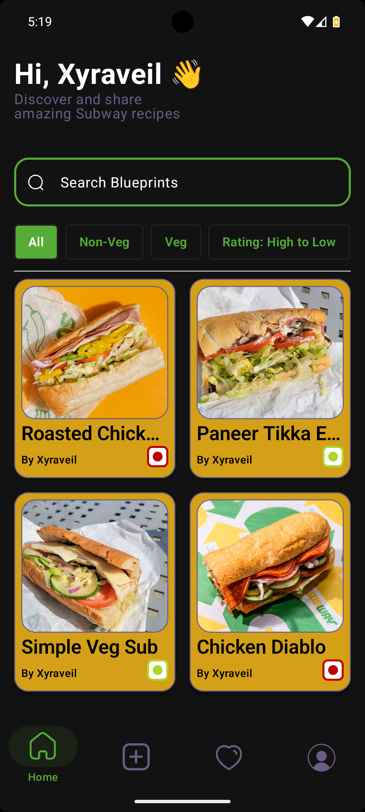
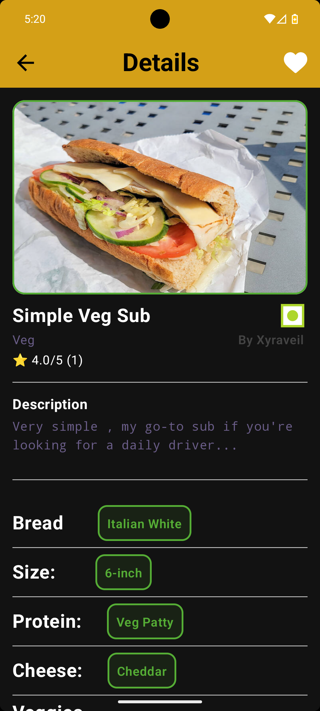
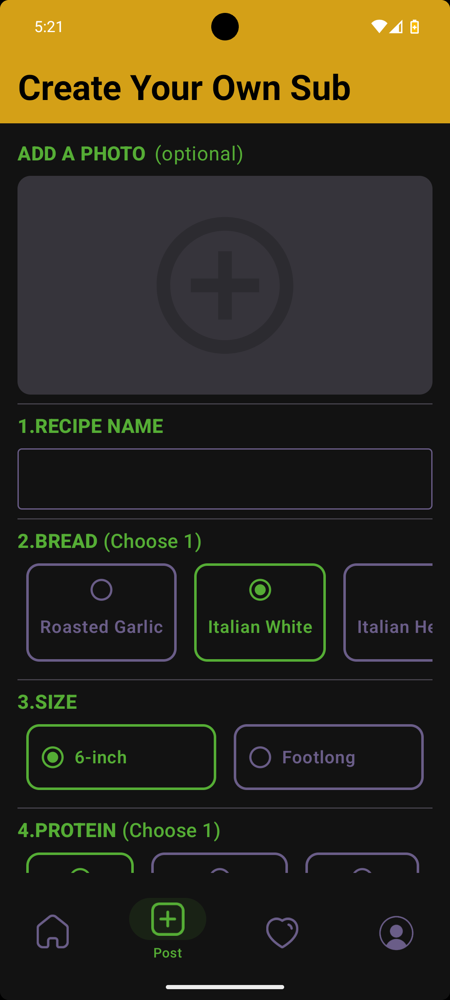
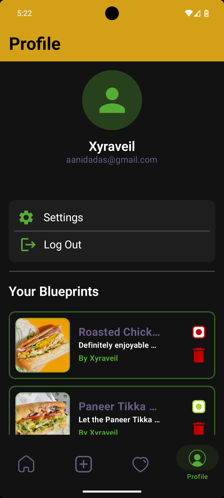

# 🥪 SubShare

<p align="center">
  
  
  
  
</p>

## 📖 About

**SubShare** is a modern Android application that allows users to create, discover, and share custom Subway sandwich recipes, which I call "Blueprints".

Users can build personalized Subway Blueprints, upload their creation's images, browse community Blueprints, save favorites, and rate recipes through an intuitive interface built with **Jetpack Compose**.

The project was built to explore modern Android development using **Kotlin**, **Firebase**, and **Cloudinary**, while following a repository-based architecture.

---

# ✨ Features

- 🔐 Secure user authentication with Firebase Authentication
- 🥪 Create and upload custom Subway recipes
- 📸 Upload recipe images using Cloudinary
- ⭐ 5-Star community rating system
- ❤️ Favorite recipes
- 🔍 Search recipes by title
- 🗂️ Category filtering
- ↕️ Recipe sorting
- 👤 User profiles
- 🗑️ Delete your own uploaded recipes
- ☁️ Cloud-based data storage with Firebase Firestore

---

# 📱 Screenshots

## Home Screen

<p align="center">
  
</p>

## Recipe Details

<p align="center">
  
</p>

## Create Recipe

<p align="center">
  
</p>

## Profile Screen

<p align="center">
  
</p>
---

# 🛠 Tech Stack

| Category | Technology |
|-----------|------------|
| Language | Kotlin |
| UI Toolkit | Jetpack Compose |
| Authentication | Firebase Authentication |
| Database | Firebase Cloud Firestore |
| Image Hosting | Cloudinary |
| IDE | Android Studio |
| Version Control | Git & GitHub |

---

# 📂 Project Structure

```
SubShare
│
├── data
│   ├── repository
│
├── domain
│   └── model
│
├── presentation
│   ├── navigation
│   ├── screens
│   ├── ui_components
│   └── theme
│
└── MainActivity.kt
```

---

# 🚀 Getting Started

### Clone the repository

```bash
git clone https://github.com/Xyraveil/SubShare.git
```

Open the project in **Android Studio**.

### Configure Firebase

Create your own Firebase project and add your own

```
google-services.json
```

inside

```
app/
```

### Configure Cloudinary

Replace the Cloudinary credentials in the project with your own.

---

# 💡 Future Improvements

- 💬 Recipe comments and discussions
- ✏️ Edit uploaded recipes
- 📈 Personalized recipe recommendations
- 🔔 Push notifications
- 📤 Share recipes via links
- 🥗 Nutritional information with automatic calorie calculator
- 💰 Estimated price range calculator for each recipe
- 🔃 Sort and filter recipes by calories and estimated price

---

# 👨‍💻 Author

**Aanid Das**

- GitHub: https://github.com/Xyraveil

---

## ⭐ If you like this project

Feel free to ⭐ the repository!
